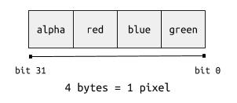
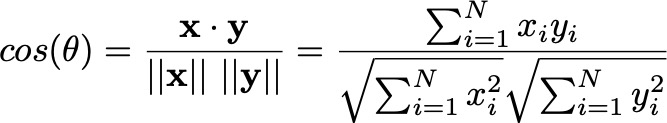
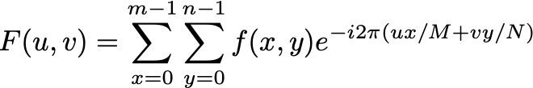
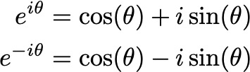
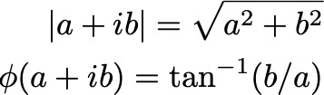

**CPEN 221 / Fall 2020**

# MiniProject 1: Image Processing

We will work with images (in JPEG and PNG formats) and have some fun. Image processing and computer vision algorithms are a key component of autonomous cyber-physical systems, biomedical systems, and even simple task automation systems. With this mini-project, we hope to expose you to some ideas in this application subdomain of computing.

An image is a -- for our purposes -- a **datatype** that supports a set of operations. In addition to implementing the required methods, you will need to develop robust testing strategies for your work and demonstrate code coverage. You should also write method specifications as needed to ensure readability and maintainability of the codebase.

## Background

In a computer, we represent images using a matrix of pixels. A pixel is a colour at some (x, y) coordinate. The value of a colour/pixel is an `int` with the four bytes (an `int` in Java is four bytes long) representing the following components: an alpha value, which represents the transparency level of the pixel, and then red, green and blue colour values. Each of these four values is, then, a value between 0 and 255.



(In this MP, when in doubt, use alpha = 255. We are not interested in transparency for the miniproject.)

We can access the data in an image through standard Java APIs (API = application programming interface). The top-left corner of an image would be pixel (`0`, `0`), and the bottom-right corner would be the pixel (`width - 1`, `height - 1`), where the size of the image is `width x height`.

Given that an image is a matrix, we can perform a variety of operations on an image. And that will be the goal of this mini-project. `Image` is a datatype and you will implement another datatype `ImageTransformer` that allows you to perform various operations on an image.

You are given the implementation of a datatype `Image` in the package `ca.ubc.ece.cpen221.ip.core` that supports some required operations so that you do not have to write those by relying on Java's libraries alone:

```java
/* Opening an image from a file */
/* You can provide a file name and open that file as an Image */
Image img = new Image("resources/2092.jpg");

/* Creating an empty Image with all black pixels */
/* You will need to provide the width and height of the image */
Image img = new Image(640, 480);

/* Obtaining the width and height of an image */
int width = img.width();
int height = img.height();

/* Get the colour of a pixel as a Color object ref */
Color pixelColour = img.get(column, row);

/* Get the colour of a pixel as an int that represents RGB */
int pixelColour = img.getRGB(column, row);

/* Setting the colour of a pixel has two options */
img.set(column, row, colour); // using a Color object ref
img.set(column, row, rgb); // using the RGB values represented as an int

/* Show an image on the screen in a separate window */
img.show();
```

Read through the implementation of `Image` should you have questions about what else is supported or how the datatype is implemented.

Use the implementations of `ImageTransformer.grayscale()` and `ImageTransformer.red()` as examples of image transformations. You will also be working with bitwise operations (`ImageTransformer.red()` is an example) so you may want to [read about these operations](https://docs.oracle.com/javase/tutorial/java/nutsandbolts/op3.html).

## Main Tasks

### Task 1: Simple Operations

* Implement a transform that produces a mirroring of a given image. (This is what video conferencing tools like Zoom do.)

* Transform an image to its negative: if the colour of a pixel is (r, g, b) then the colours of the same pixel in the negative of the image are (255-r, 255-g, 255-b).

* Posterize an image: This transform produces an image that uses a restricted number of colours. For each pixel, analyze each colour independently and produce a new image as follows:
    * if the value of the colour is between 0 and 64 (both limits inclusive), set it to 32;
    * if the value of the colour is between 65 and 128, set it to 96;
    * if the value of the colour is between 129 and 255, set it to 222.
    
* Clip an image: Given the top-left corner of a rectangle as well as the bottom-right corner of the same rectangle, clip the image to match the rectangle (in other words: copy the contents within the given rectangular region).
  
### Task 2: Some More (Simple) Operations

* Simple de-noising: Replace the value of a pixel by the median value of that pixel and its neighbouring pixels. Each pixel may have up to 8 neighbouring pixels. Each colour channel should be handled separately (you do not take the median of the entire pixel/colour value).

* Simulate weathering: Replace the value of a pixel by the minimum value of its neighbours, again considering each colour separately.

* Block painting: Treat the image as a sequence of `m x m` blocks. For each block, replace all pixels by the average pixel. As always, treat each colour separately when averaging pixels. `m` is a parameter for this transformation that is very weakly modelled on Seurat's paintings. 

### Task 3: Rotation and Similarity

* Rotation: Rotate an image about its centre by a specified angle, in the clockwise direction. Some linear algebra may suggest that we could use the following approach (you will have to add some translation to the coordinates to reflect the fact that all coordinate values are >= 0):
    ```java
    for (int col = 0; col < width; col++) {
        for (int row = 0; row < height; row++) {
            int x_new = (int) Math.round(Math.cos(degrees * Math.PI / 180) * (col - width / 2) +
                Math.sin(degrees * Math.PI / 180) * (row - height / 2));
            int y_new = (int) Math.round(-Math.sin(degrees * Math.PI / 180) * (col - width / 2) +
                Math.cos(degrees * Math.PI / 180) * (row - height / 2));
            outImage.set(x_new, y_new, original_image.get(col, row));
        }
    }
    ```
    
    This approach shown above will result in significant distortion for rotation when the angle is not a multiple of 90 degrees because many pixels in the output image will not have a mapping from a pixel in the original image.
    
    The approach you should implement, called the nearest neighbour interpolation, is to use reverse lookups (using the inverse of the rotation matrix). This can be expressed as:
    
    ```java
          for (int col = 0; col < new_width; col++) {
              for (int row = 0; row < new_height; row++) {
                  int original_x = (int) ((col - width / 2) * Math.cos(degrees * Math.PI / 180) +
                      (row - height / 2) * Math.sin(degrees * Math.PI / 180) + original_width / 2);
                  int original_y = (int) (-(col - width / 2) * Math.sin(degrees * Math.PI / 180) +
                      (row - height / 2) * Math.cos(degrees * Math.PI / 180) + original_height / 2); 
                  if (original_x >= 0 && original_y >= 0 && 
                      original_x < original_width &&
                      original_y < original_height) {
                      outImage.set(col, row, original_image.get(original_x, original_y));
                  }
              }
          }
    ```
  
  The dimensions of the rotated image may be larger than the dimensions of the original image, and you should use the smallest possible dimensions for the rotated image. The regions in the rotated image that do not have a mapping to the original image should be coloured white (`Color.WHITE`).

* Cosine Similarity: We would like to compare two images to determine how similar they are. To do so, we will use the _grayscale_ version of both images and compute the cosine similarity between the two images. We first transform the images from an `m x n` matrix to a vector of length `m x n`, with row 0 appearing before row 1 and so on. The cosine similarity between two vectors of equal length, **x** and **y**, is (and for this MP, the vector length `N = m x n`):

    
    
    This functionality should not be implemented in `ImageTransformer` but should be a `static` method in `ImageProcessing`.

### Task 4: The Discrete Fourier Transform 

Compute the Discrete Fourier Transform of the provided image. We will use grayscale images for computing the DFT. The DFT of an `m x n` image is computed as follows:



The DFT captures the frequency variations of pixel intensities using two-dimensional sine and cosine waves. For an `m x n` image, we obtain `m x n` frequency components (we compute F(0,0), ..., F(m-1, n-1)), which can also be represented using an `m x n` matrix of complex numbers.

We can use the result due to Eüler (see below) to represent a DFT using two matrices, one that represents the magnitude of the complex numbers and the other representing the phase of the complex numbers.



The magnitude and phase are:



A [Plus magazine article](https://plus.maths.org/content/fourier-transforms-images) provides a good introduction to spatial DFTs. 

### Task 5: Green Screening

Given a specific colour, identify the largest connected region of the image that matches exactly that colour. Then determine a rectangle the bounds this "green screen" region. After determining the bounding rectangle, overlay a (provided) background image on that rectangle, and replace all the pixels matching the specified colour with corresponding pixels from the background image. When the background image is smaller than the bounding rectangle, tile the background image. To overlay the background image on the bounding rectangle, the (0, 0) pixel of the background image should correspond to the top-left corner of the rectangle.

### Task 6: Aligning Images with Text

Implement an algorithm that will allow us to **align** a scanned **text document** when the image is not properly aligned (there is an angular shift). Use the results of the DFT to achieve this correction. The magnitude component of the DFT output will reflect the angle by which the scanned image is rotated from the perpendicular.

This task is deliberately open-ended. We may provide resources and ideas after the intermediate deadline to students that would like more information for this task. 

## Implementation and Testing

- Follow the course style guide.
- Write specifications for any new methods that you add. Improve specifications to the provided (skeleton) methods as appropriate.
- Construct test cases that will help you test all aspects of your implementation. As you write tests, use IntelliJ's code coverage tool to evaluate the coverage of the tests. You should achieve 100% class coverage and at least 90% lines-of-code coverage as well as at least 90% branch coverage via your tests. Add your own test cases to a **different** Java file in the appropriate folder. (You do not need to test the code in the `ca.ubc.ece.cpen221.ip.core` package.) For obtaining test coverage information using IntelliJ IDEA, see [this documentation page](https://www.jetbrains.com/help/idea/running-test-with-coverage.html#read-coverage%20report), which also discusses how you can enable branch coverage.
- You are expected to write helper methods (usually, though not always, `private` methods) to keep individual methods small.

## Directory Structure and Gradle

We use `gradle` as a tool to compile your programs and run test cases. [Gradle is a build system](https://gradle.org/) that handles a variety of tasks that enable us to compile, test (and even deploy) our applications.

**You should preserve the directory structure for the codebase.** All of your implementation must be in the directory `src/main/java/ca/ubc/ece/cpen221/ip/mp`. If you introduce new classes then they should also be in the same directory and would need the statement `package ca.ubc.ece.cpen221.ip.mp;` at the top of the Java file. All your tests should be in the `src/test/java/ca/ubc/ece/cpen221/ip/mp` directory. Changing the directory structure will break the build process and your work will not receive any credit if your alter the directory structure.

## Intermediate Milestone

This is an opportunity to get some feedback from the TAs. We are not looking for perfect implementations at the intermediate milestone but *sufficient* progress (e.g., most of the requested methods work but have minor bugs; testing coverage is not at the desired level). *Insufficient progress* will result in a lowered grade.

You should aim to complete -- at the least -- Tasks 1, 2 and 3.

You should push your work to the GitHub repository that you are using. Create a new branch called `milestone1` and push this branch to GitHub for the intermediate milestone. Read the module on git and branching (on Canvas). This [tutorial](https://www.atlassian.com/git/tutorials/using-branches) is an additional resource.
## Teamwork

* You will be working in teams of 3 for this MP. Read the note on **Teamwork** that has been included in the course syllabus.
* Plan the division of work. 
* Your final commit before the submission deadline **must** include files named `CONTRIB-ghusername.md` where `ghusername` should be replaced by the GitHub username of a team member, and these files should include a list of contributions made by that team member. (Your repository should, therefore, have three such files.) These files must be in the top-level directory of your repository, where this `README.md` file is. 
* Academic integrity also involves claiming credit only for the work one did and not for the work of others. 
* We expect contributions from each team member and will occasionally use the record of contributions to the GitHub repository as an indicator of participation level.
* The staff reserve the right to adjust scores for the MP based on contribution levels. 

## Submission

You will submit your work via GitHub, by pushing your work to the repository that was created for your by GitHub Classroom.

## Hints

* **Start early!**
* **MPs involve a non-trivial amount of work.** 
The MPs are structured to help you maximize your learning, and to expose you to new ideas. Don't be daunted by the scope of the MPs.
* **Think before you start writing code.** 
With some planning, you will not have to write a lot of code.
* **Debug systematically.** 
Learn to use the debugger. You will save time.
* **Start writing test cases early.**
Testing is important. Good test cases will speed up your implementation process and help you find bugs early.
* **Use pre-designed datatypes.**
Read about Java's `Set`s, `Map`s, and `List`s. Use them wisely. Don't reinvent the wheel.
* **Complete a task fully and thoroughly** rather than having partial success with the tasks. Partial implementations of tasks do not get any credit.
* To help you plan your work: each task in this MP will be worth 1 point. Functional correctness alone is not sufficient. If you do not test your code sufficiently, if you do not follow the style guide (minor deviations are okay) or if you do not write clear specifications, you will obtain a lower score even if your implementation passes all the tests we run. As an example, suppose you complete Tasks 1-4 (normally a score of 4) from a functional correctness perspective, but you have inadequate testing, or you have documented your code poorly (insufficient specifications, etc.), or you have excessive violations of the style guide, or your implementation does not use helper functions to manage useful and common operations then you may only score a 3. 